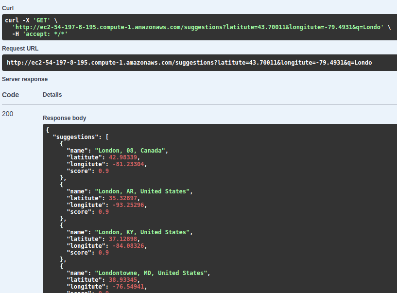

# Cities Suggester

A REST API endpoint that provides auto-complete suggestion for large cities

## Environment Variables

To run this project, you will need to add the following environment variables to your the project

#### .env.dev:

`DEBUG`

`SECRET_KEY`

`DJANGO_ALLOWED_HOSTS`

#### .env.prod:

`SECRET_KEY`

`DJANGO_ALLOWED_HOSTS`

## Run Locally

Clone the project

```bash
git clone https://github.com/tobianointing/talnts-backend-task.git
```

Go to the working directory

```bash
cd talnts-backend-task/app
```

Install dependencies

```bash
pipenv install
```

Activate virtual environment

```bash
pipenv shell
```

Migrate

```bash
python manage.py migrate
```

Start sever

```bash
python manage.py runserver
```

## Run development server with docker compose

Go to project directory

```bash
cd talnts-backend-task
```

build the containers

```bash
docker compose -f docker-compose.yml up -d --build
docker compose -f docker-compose.prod.yml exec web python manage.py migrate --noinput
```

## Run production server with docker compose

Go to project directory

```bash
cd talnts-backend-task
```

build the containers

```bash
docker compose -f docker-compose.prod.yml up -d --build
docker compose -f docker-compose.prod.yml exec web python manage.py migrate --noinput
docker compose -f docker-compose.prod.yml exec web python manage.py collectstatic --no-input --clear
```

## Screenshots



## Tech Stack

- Python
- Django
- Django Rest Framework

## Technologies

- Docker
- Ngnix

## Running Tests

To run tests, run the following command

```bash
python manage.py test
```

## Usage/Examples

```bash
curl -X 'GET' \
'http://ec2-54-197-8-195.compute-1.amazonaws.com/suggestions?latitute=43.70011&longitute=-79.4931&q=Londo' \
-H 'accept: */*'
```

## Authors

- [@tobianointing](https://www.github.com/tobianointing)

## Documentation

[Documentation](http://ec2-54-197-8-195.compute-1.amazonaws.com/api/schema/swagger-ui/)

## License

[MIT](https://choosealicense.com/licenses/mit/)
